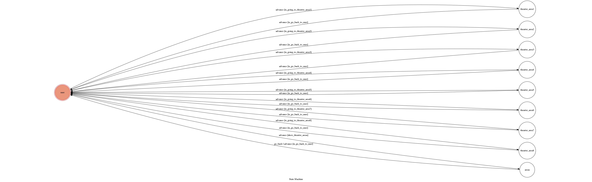

# TOC Project 2017

f74036378'S Code for TOC Project 2017

A telegram bot based on a finite state machine

## Setup

### Prerequisite
* Python 3

#### Install Dependency
```sh
pip install -r requirements.txt
```

* pygraphviz (For visualizing Finite State Machine)
    * [Setup pygraphviz on Ubuntu](http://www.jianshu.com/p/a3da7ecc5303)

### Secret Data

`API_TOKEN` and `WEBHOOK_URL` in app.py **MUST** be set to proper values.
Otherwise, you might not be able to run your code.

### Run Locally
You can either setup https server or using `ngrok` as a proxy.

**`ngrok` would be used in the following instruction**

```sh
ngrok http 5000
```

After that, `ngrok` would generate a https URL.

You should set `WEBHOOK_URL` (in app.py) to `your-https-URL/hook`.

#### Run the sever

```sh
python3 app.py
```

## Finite State Machine

this picture has some problem with no last two state

## Usage
The initial state is set to `user`.

Every time `user` state is triggered to `advance` to another state, it will `go_back` to `user` state after the bot replies corresponding message.

* user
	* Input: "show"
		* Reply: all the thearters' name and their number

	* Input: thearters' number
		* Do: go to state : thearter_area<number>
		* Reply: all the movies this thearter will play today and their 			number
* thearter area<number>
	* Input: movie number
		* Do: go to show_time state
		* Reply: all the time of the movie
* show time
	* Input: "back"
		* Do: go back to user state
		* Reply: nothing
	* Input: "look"
		* Do: go to pre_look state and go back to user
		* Reply: the notice of the movie

## Author
[F74036378](https://github.com/F74036378)
